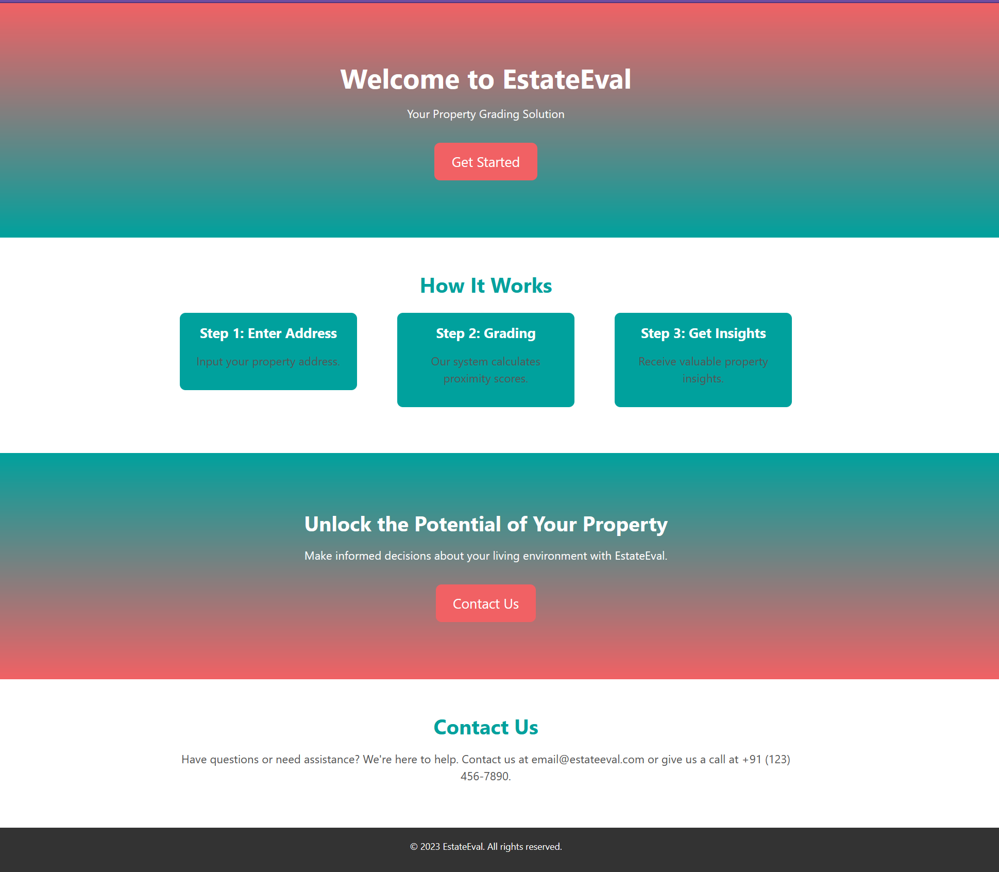
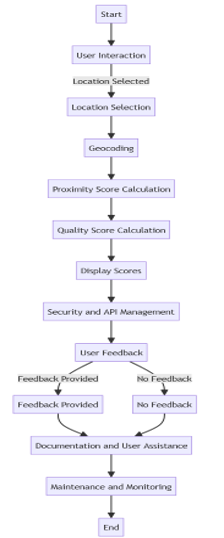

## Team Name: Localis

##### Problem Statement: EstateEval - A web application which evaluates and provides normalised Proximity and Quality scores of a real estate property based on proximity to services/retail and quality of the surrounding area based on environmental factors.
 
##### Team Leader Email : 22f1000372@ds.study.iitm.ac.in or arjun.balaji.02@gmail.com

## A Brief of the Prototype:
EstateEval is a web application that harnesses Google Maps APIs to help users assess potential properties. It calculates a Proximity Score by measuring the distances to hospitals and transportation hubs and a Quality Score based on air quality and various environmental factors. Users select locations on a Google Map, receiving immediate scores, aiding in informed real estate decisions. This application seamlessly integrates data and maps for a user-friendly and data-driven property evaluation tool.

## Tech Stack:
- Front-End Tech Stack:HTML/CSS/JavaScript: The front-end of the application is built using HTML for structure, CSS for styling, and JavaScript for functionality.
- Google Maps APIs/SDKs used: Google Air Quality Index API, Google Maps JavaScript SDK, Google Maps Distance Matrix API, Google Places API, Google Maps Geocoding API, Google Maps JavaScript API.

## Step-by-Step Code Execution Instructions:
1) Download the folder and open it using a Code Editor such as VSCode.
2) Edit script.js:line 263 and estateeval.html:line 35 and replace YOUR_API_KEY_HERE with your google maps API key.
3) Open the landing page file using Live Server to see the Landing Page and click on Get Started to use the Estate Evaluator Application.
4) Alternatively, you can directly open the EstateEval file using Live Server.
5) To use the application, Enter the address of the property you would like to evaluate in the box.
6) The Proximity Scores and Quality Scores will display on the side bar and you can zoom out to see the markers of the locations.

## Future Scope:
1) Additional Property Evaluation Metrics: Expanding the range of evaluation metrics to provide users with even more comprehensive insights into potential properties. This could include factors like school ratings, nearby recreational facilities, public transportation accessibility, and more.
2) User Profiles and Saved Evaluations: Implementing user accounts to allow users to save their property evaluations, track their property search history, and receive personalized recommendations based on their preferences.
3) Mobile Application: Developing a mobile application version of EstateEval for users to assess properties on the go. Mobile apps can also leverage features like geolocation for a seamless user experience.
4) Machine Learning and Predictive Analysis: Integrating machine learning models to predict property appreciation rates, rental income potential, and other real estate trends based on historical data.

Flowchart:

